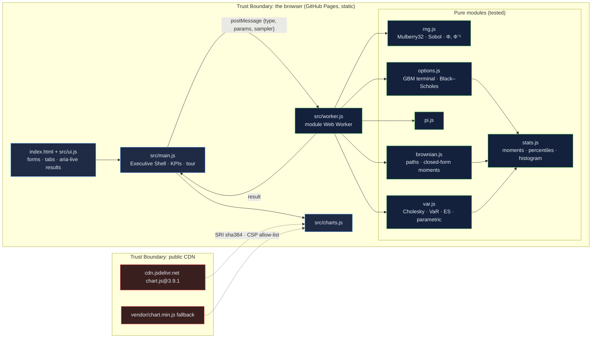

# Monte Carlo Simulation Engine: four stochastic problems with the closed-form answer printed beside every estimate

[](https://github.com/Freddricklogan/monte-carlo-simulator/actions/workflows/deploy.yml)
[](#5-getting-started--verification)
[](https://github.com/Freddricklogan/monte-carlo-simulator/actions/workflows/codeql.yml)
[](LICENSE)
[](https://freddricklogan.github.io/monte-carlo-simulator/)

## 1. Executive Summary & Business Impact

**Problem statement.** Monte Carlo is the method every quant course teaches
and every browser demo gets slightly wrong: an estimate with no benchmark,
a confidence interval computed on the wrong variable, percentiles by
truncation, a progress bar that measures nothing. A reader cannot tell
whether the number on the screen is right, and the previous version of this
tool had every one of those faults (see `AUDIT.md`).

**Solution & value delivered.** A browser lab for four classic problems —
European option pricing, π, geometric Brownian paths, three-asset portfolio
VaR — that runs in a real module Web Worker under a strict content-security
policy, with a seeded pseudo-random source or a Sobol quasi-random sequence,
antithetic variance reduction, and the closed-form answer beside each
estimate: Black–Scholes for the option (error shown in standard-error
units), the analytic standard error for π, the terminal moments for GBM,
and parametric VaR for the portfolio. Thirty tests include
statistical-tolerance tests that would fail if the estimators drifted.

**[→ Read the full case study](docs/CASE_STUDY.md)**

| Outcome | How this repo delivers it |
| --- | --- |
| Every estimate is checkable | Black–Scholes (Hart's Φ), π's standard error, GBM moments and parametric VaR printed beside the Monte Carlo figure |
| Variance reduction you can see | Antithetic pairing and a Sobol sequence (Joe–Kuo, six dimensions) selectable per run; the SE-units figure shows the gain |
| Honest statistics | Standard errors from the discounted payoffs; interpolated percentiles; positive-loss VaR and expected shortfall; Cholesky that refuses impossible correlations |
| Runs under a strict CSP | Real module worker, pinned Chart.js with SRI and a vendored fallback, no inline script or style |
| Reproducible | Seeded Mulberry32 and deterministic Sobol; the same inputs give the same figures |

## 2. Demonstrated Competencies & Technical Skills

- **Data Science & AI** — pseudo- and quasi-random sampling, inverse-normal
  transform (Acklam with a Halley step), Box–Muller, antithetic variates,
  Cholesky-correlated draws, VaR and expected shortfall, statistical
  tolerance testing against closed forms.
- **Systems Architecture & CS** — pure ES modules with a DOM layer kept
  separate, a module Web Worker with a promise-based request map, Chart.js
  behind a loader that degrades gracefully.
- **Cybersecurity & Compliance** — `default-src 'none'`, `worker-src
  'self'`, SRI computed against the artifact, CodeQL and Trivy in CI,
  advisory link check.
- **EdTech & Human-Centered Design** — the tour walks from a pseudo-random
  estimate to the Sobol rerun so the reader sees the error fall; every
  method statement is on the page.

## 3. System Architecture & Data Flow



No network calls leave the page beyond the pinned chart library. No backend, no account, no telemetry.

## 4. Technical Highlights & Engineering Decisions

### ADR-1 — Put the closed form beside the estimate, and test the distance

**Context.** The previous build printed a Monte Carlo call price with no
benchmark and a "95% CI" built from the standard deviation of the stock
prices rather than the payoffs (`AUDIT.md` A1–A2).

**Decision.** `blackScholes()` uses Hart's double-precision Φ; the page
shows the absolute error in units of the payoff standard error, and
`tests/options.test.js` requires the seeded estimate to fall within three
standard errors of Black–Scholes.

**Consequence.** A wrong estimator fails CI rather than looking plausible.
The same pattern covers π (analytic SE), GBM (closed-form moments) and VaR
(parametric benchmark within 3%).

### ADR-2 — Sobol for options, π and VaR; never for stepped paths

**Context.** A quasi-random sequence needs one dimension per random input.
An option price and π need one and two; the VaR needs three; a 250-step
path needs 250.

**Decision.** `sobol()` implements six dimensions from Joe–Kuo direction
numbers and the worker forces the seeded pseudo-random source for paths.
`tests/brownian.test.js` documents why: feeding successive 1-D Sobol points
to the steps collapses the terminal standard deviation to under half the
closed form.

**Consequence.** Users get the variance-reduction gain where it is valid and
a stated reason where it is not, instead of a silently wrong distribution.

### ADR-3 — A real worker file, because a Blob worker cannot pass a strict CSP

**Context.** The original built its worker from a template string and a
`blob:` URL, which `script-src 'self'` forbids.

**Decision.** `src/worker.js` is a module worker loaded by URL; the page
adds `worker-src 'self'`; requests are matched to promises by id so
concurrent tabs cannot receive each other's results.

**Consequence.** The demo runs under the portfolio's standard policy, and
the previous bug where every tab overwrote `worker.onmessage` is gone.

## 5. Getting Started & Verification

**Prerequisites.** Node 22 LTS. No build step; the page is served from the
repository root.

```bash
git clone https://github.com/Freddricklogan/monte-carlo-simulator.git
cd monte-carlo-simulator
npm ci
npm run lint && npm run validate && npm run coverage
npx serve .    # open http://localhost:3000
```

**Verification — the numbers this repository actually produced:**

```bash
npm run coverage   # 30 passed / 30; All files 99.14% stmts, 94.01% branches
npm run lint       # 0 problems
npm run validate   # html-validate index.html: clean
```

| Check | Result |
| --- | --- |
| Unit tests (Vitest) | **30 passed / 30** across 6 files, including statistical-tolerance tests (3 SE) and Sobol's published first points |
| Coverage (pure modules) | **99.14%** statements, **94.01%** branches (`main.js`, `ui.js`, `worker.js`, `charts.js` covered by the browser smoke test) |
| ESLint, html-validate | clean |
| Black–Scholes benchmark (S 100, K 105, σ 0.2, r 0.05, T 1) | call 8.0214, put 7.9004; put–call parity to 1e-9 |
| Headless Chrome smoke | **0 console errors**; pseudo-random call $7.87 vs $8.02 (1.60 SE) → Sobol $8.02 (0.04 SE); antithetic 0.06 SE; π 3.13920 (error 0.00239 < SE 0.01161); GBM std 0.1665 vs closed form 0.1667; VaR 95% $134,475 vs parametric $135,188; five tour steps; no horizontal scroll at 1280 or 400 px |

## 6. Live Demo & Production Showcase

**<https://freddricklogan.github.io/monte-carlo-simulator/>**

**30-second guided walkthrough.** Press **Take the 30-second tour**.

1. **Price an option against the benchmark** — 20,000 terminal prices; the
   error in SE units beside Black–Scholes.
2. **Switch to Sobol and rerun** — same paths, the error falls.
3. **Estimate π** — points in the circle, with the pseudo-random SE.
4. **Generate paths** — 200 GBM paths and the closed-form moments.
5. **Portfolio VaR two ways** — Monte Carlo and parametric, side by side.

Every figure is reproducible: same seed, same inputs, same numbers.
